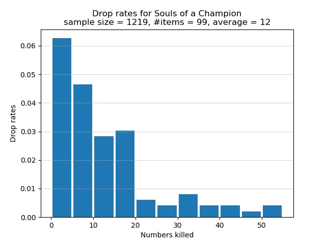
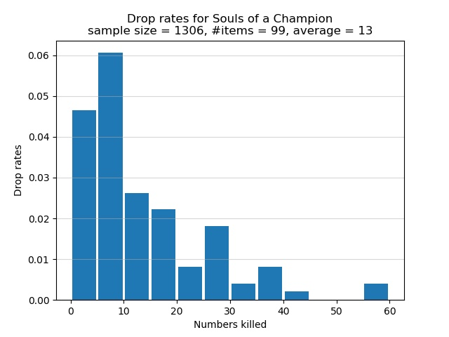

# Ringed City: Preachers

From NG+1 onwards, the Preachers in the swamp drop Souls of a Champion, each of
which is valued at 25,000 souls. The drop is rare. I recommend you to have as
high Item Discovery as possible. The safest farming route consists of starting
from the Ringed City Streets bonfire and kill the 4 nearby aggressive Preachers.
Ignore the 5th Preacher who is standing on an elevated platform. He won't be
aggressive towards you unless you hit him. If you venture further away from the
bonfire in the direction of the Dragonslayer Armour, you would be met with a
number of Hobbled Clerics, who can easily kill you with their miracles. If you
somehow get close to the Judicator Giant, you would very likely be easily ganked
to death. It's safest to farm the 4 Preachers near the bonfire. Fight one
Preacher at a time. Consider using a fire weapon such as a Chaos infused Lothric
Knight Sword+10. Hit the Preacher a few times with R1. When he winds up his
sorcery and starts to pounce at you, strafe around him and continue spamming R1.

If you're confident that you can kill a Hobbled Cleric in a few hits, consider
farming the Preachers along the following extended route. Start from the Ringed
City Streets bonfire and dispatch of the 2 nearby hostile Preachers, followed by
the 2 nearby Preachers who are buried in the swamp. In the distance is a lone
Preacher foraging next to a corpse; kill him as well. There should be a nearby
fallen tower on top of which is a Hobbled Cleric. Eliminate the Hobbled Cleric
as quickly as possible and kill the Preacher at the foot of the tower. Press on
your way along the shore of the swamp to find a lone Preacher who is foraging,
separated from a group of 4 Preachers who are also foraging nearby. As you
approach this lone Preacher, you would notice another Preacher walking to your
right. Ignore this walking Preacher because if you approach the walking
Preacher, then the lone foraging Preacher would be aggressive and fight you.
Concentrate on fighting the lone foraging Preacher, followed by the 4 nearby
foraging Preachers. Now you would notice another walking Preacher who was buried
in the swamp. Kill that Preacher and the route is done. Also, dispatch of the
nearby 4 Hobbled Clerics if you have enough HP to spare.



The Preachers are weak against fire. If you want 465 Item Discovery, use the
following SL182 pyromancer build, assuming that your starting class is Knight:

```
20 Vigor
30 Attunement
20 Endurance
15 Vitality
13 Strength
12 Dexterity
31 Intelligence
31 Faith
99 Luck
Symbol of Avarice
Left hand: Crystal Sage's Rapier
Right hand: Pyromancy Flame+10
Rings: Gold Serpent Ring+3, Fire Clutch Ring, Great Swamp Ring, Witch's Ring
Spell: Chaos Bed Vestiges
```

The build should allow you to 2-shot each Preacher and any Hobbled Cleric.

## 465 Item Discovery

I now discuss the drop rates for Souls of a Champion assuming that you have 465
Item Discovery. The drop rates are summarized in the histogram below and were
obtained via the extended farming route described above. The horizontal axis
shows how many Preachers must be killed, one after the other, for a Soul of a
Champion to spawn. The vertical axis shows the chance of receiving a Soul of a
Champion after killing a certain number of Preachers. Note that each bar in the
graph lumps together 5 categories of kills. For example, the first bar
represents the cases where I had to kill 0, 1, 2, 3, or 4 Preachers in a row to
obtain a Soul of a Champion. The second bar represents the cases where 5, 6, 7,
8, or 9 Preachers must be killed in succession for a Soul of a Champion to
spawn. Instead of having a separate bar for the category of 1 kill, or 2 kills,
or 3 kills, etc., I lumped all 5 categories of kills into one bar.



In total 1,219 Preachers were defeated in order to obtain 99 Souls of a
Champion. On average I killed approximately 12 Preachers for each Soul of a
Champion. Of the Preachers who were killed, approximately 8.1% of them dropped
Souls of a Champion. The graph shows that there is over 6% chance to obtain a
Soul of a Champion after killing between 1 and 4, inclusive, Preachers in a row.
This is the best case scenario. The worst bad luck was the time I had to
successively defeat 54 Preachers for a Soul of a Champion to spawn. As the graph
shows, there is a chance of approximately 0.5% that I had to successively defeat
between 50 and 54, inclusive, Preachers in order to obtain a Soul of a Champion.

## 415 Item Discovery

I now discuss the drop rates for Souls of a Champion assuming that you have 415
Item Discovery. You can use the above pyromancer build, but without the Crystal
Sage's Rapier. The drop rates are summarized in the histogram below and were
obtained via the extended farming route described above. The horizontal axis
shows how many Preachers must be killed, one after the other, for a Soul of a
Champion to spawn. The vertical axis shows the chance of receiving a Soul of a
Champion after killing a certain number of Preachers. Note that each bar in the
graph lumps together 5 categories of kills. For example, the first bar
represents the cases where I had to kill 0, 1, 2, 3, or 4 Preachers in a row to
obtain a Soul of a Champion. The second bar represents the cases where 5, 6, 7,
8, or 9 Preachers must be killed in succession for a Soul of a Champion to
spawn. Instead of having a separate bar for the category of 1 kill, or 2 kills,
or 3 kills, etc., I lumped all 5 categories of kills into one bar.



In total 1,306 Preachers were defeated in order to obtain 99 Souls of a
Champion. On average I killed approximately 13 Preachers for each Soul of a
Champion. Of the Preachers who were killed, approximately 7.6% of them dropped
Souls of a Champion. The graph shows that there is slightly over 6% chance to
obtain a Soul of a Champion after killing between 5 and 9, inclusive, Preachers
in a row. This is the best case scenario. The worst bad luck was the time I had
to successively defeat 59 Preachers for a Soul of a Champion to spawn. As the
graph shows, there is a chance of approximately 0.5% that I had to successively
defeat between 55 and 59, inclusive, Preachers in order to obtain a Soul of a
Champion.
